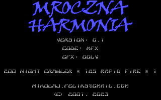

# Dark Harmony v0.1

Dark Harmony, previously known under a Polish name Mroczna Harmonia, was my first
game written in C. If I recall properly, the development started around 1999,
and it was in 2001 when I added the last changes.

Here it is again, 22 years later, cleaned up slightly and made possible to compile.

The code is really bad from today's perspective, but keep in mind that it was
written by a teenager. I had to remove the sound code, which was buggy and
never worked properly. Maybe I will add it again if I find some time.

In the meantime, enjoy Dark Harmony in all its glory!

    

## Installation instructions

To compile Dark Harmony, you need [Turbo C++ 3.0](https://winworldpc.com/product/turbo-c/3x)
and a PC running DOS. You can also use a DOS emulator, for example DOSBox or 
a VirtualBox VM with DOS.

Once you have Turbo C++ 3.0 installed, make sure that the PATH variable is updated 
in autoexec.bat like so:

    PATH C:\TC\BIN;%PATH%

Then enter the game directory, and build the executable:

    C:\HARMONIA > make

And run the executable:

    C:\HARMONIA > harmonia.exe

## Q&A

1. How to play Dark Harmony?

    Once in the intro screen, hit \<SPACE\> to enter the game. Use keyboard arrows to control 
    the position of the player. Use \<CTRL\> to fire the weapon at the alien ships. You can
    hit \<SPACE\> at any time to pause the game. Return to the game by pressing any of the
    arrow keys. Use \<ESC\> to exit the game.

2. What power-ups can be collected? 

    The power-up system is super simple. After killing 20 alien ships, a power-up will
    pop up at a random position. Collect it by flying your ship towoards it. A power-up
    upgrades the weapon and at the same time adds one "life". If you get hit by an alien
    ship, not only do you lose one "life", but your weapon is downgraded as well.

3. Are there levels in the game?

    Not really. As you keep killing alien ships and collecting power-ups, new types of alien
    ships continue to show. After some time, no new types are shown, and the game just
    continues. 

4. What is the future of this project?

    If the time permits, I may clean up the code a bit more. I may also add a new sound system,
    becuse the old one was extremely crude and buggy. It may be interesting to experiment
    with different compilers and port the game to a different platform. For now, only the minimum
    work has been done to be able to compile the game. 
